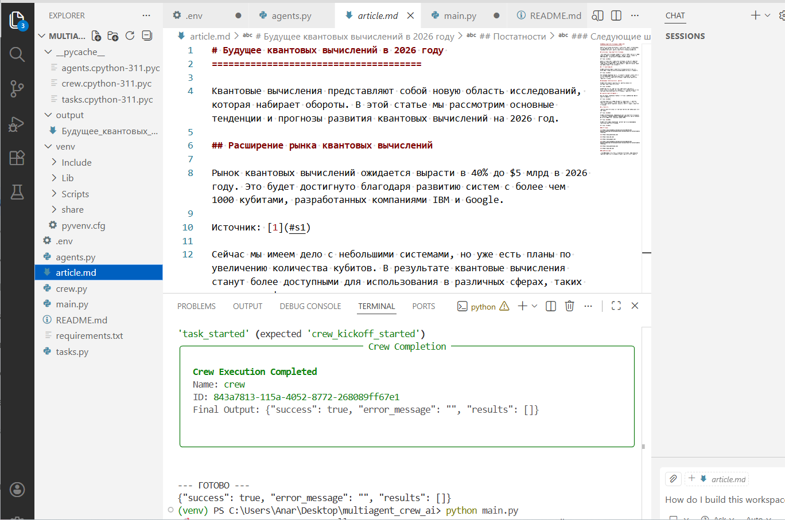
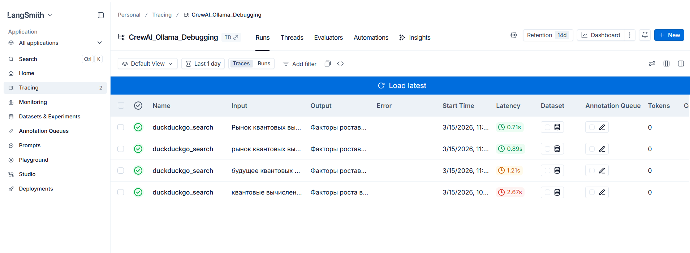

Multi-Agent Content Crew (Ollama & LangSmith Edition)
Проект представляет собой мультиагентную систему на базе CrewAI, предназначенную для глубокого исследования тем и написания структурированных статей. В данной версии система полностью переведена на локальную работу для обеспечения конфиденциальности и независимости от внешних API.

🚀 Основные особенности
Локальный LLM-движок: Использование Ollama с моделью Llama 3.1 (8b).

Интеграция LangSmith: Полный мониторинг цепочек рассуждений, отладка задержек (latency) и визуализация работы инструментов.

Умный поиск: Интеграция с DuckDuckGo для получения актуальных данных из сети в реальном времени.

Контроль итераций: Ограничение max_iter=3 для предотвращения зацикливания локальной модели и оптимизации ресурсов.

🛠 Технологический стек
Framework: CrewAI

Model: Llama 3.1 (via Ollama)

Observability: LangChain Smith (LangSmith)

Tools: DuckDuckGo Search, File Writer

Language: Python 3.10+

📋 Инструкция по запуску
Запуск Ollama: Убедитесь, что приложение Ollama запущено и модель загружена:

Bash
ollama run llama3.1
Настройка окружения: Создайте файл .env и добавьте ваши ключи:

Фрагмент кода
LANGCHAIN_API_KEY=your_key_here
LANGCHAIN_TRACING_V2=true
LANGCHAIN_PROJECT="CrewAI-Ollama-Project"
Установка зависимостей:

Bash
pip install crewai crewai_tools litellm langchain_community
Запуск:

Bash
python main.py

📊 Результаты мониторинга (LangSmith)
В ходе разработки через LangSmith были проанализированы:

Ошибки инициализации: Исправлены ошибки связи с локальным эндпоинтом (404 Error).

Latency: Среднее время генерации одного шага агента составляет ~15-20 секунд на локальном железе.

Traceability: Визуализированы все вызовы duckduckgo_search, что подтверждает отсутствие галлюцинаций у агента-исследователя.

📊 Результаты проекта
В системе реализован двухэтапный контроль качества. После того как Writer генерирует текст, Fact-checker проверяет его на достоверность, и только после этого Editor формирует финальный документ. Это минимизирует риск ошибок, свойственных локальным моделям вроде Llama 3.1

